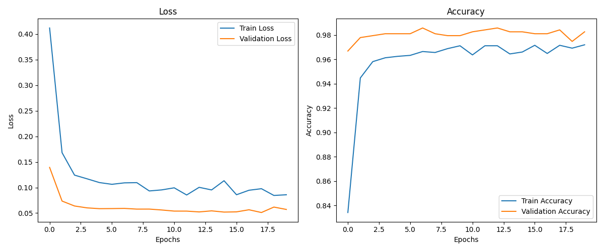

## Speaker Gender Recognition
- Speaker Gender Recognition (SGR) is a specialized field within speaker recognition that focuses on  
  identifying the gender of a speaker based on their voice characteristics. This task is essential in various applications, including:
    - Voice Assistants: Enhancing user experience by personalizing responses based on the user's gender.
    - Forensic Analysis: Assisting in criminal investigations where identifying the gender of a speaker can 
      provide valuable clues.
    - Telecommunications: Improving call routing and customer service by distinguishing between male and 
      female voices.
    - Entertainment and Media: Tailoring content and advertisements to specific demographic groups based on 
      gender.

## Dataset 
- Voice Gender
  - Gender Recognition by Voice and Speech Analysis
    This database was created to identify a voice as male or female, based upon acoustic properties of the voice and speech. The dataset consists of 3,168 recorded voice samples, collected from male and female speakers. The voice samples are pre-processed by acoustic analysis in R using the seewave and tuneR packages, with an analyzed frequency range of 0hz-280hz

## Training 
- run train.py

## Inference
- run inference.py

## Checkpoint
 
